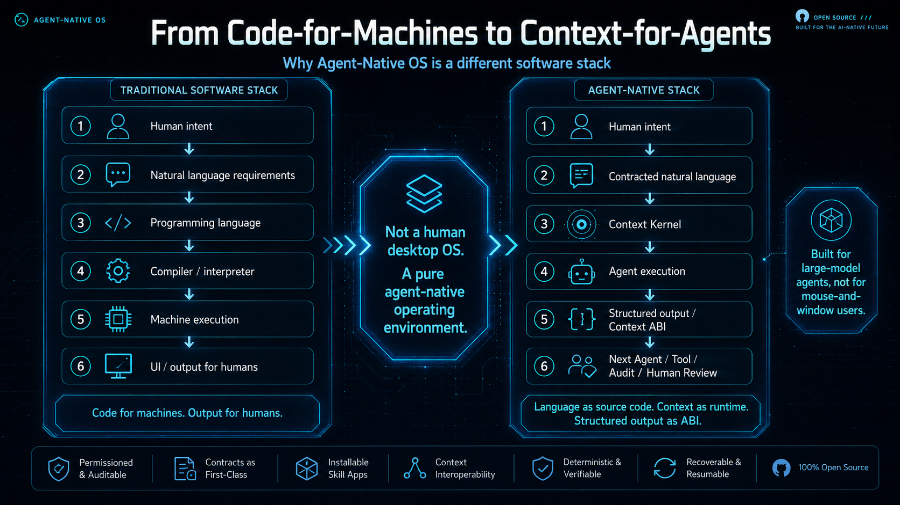
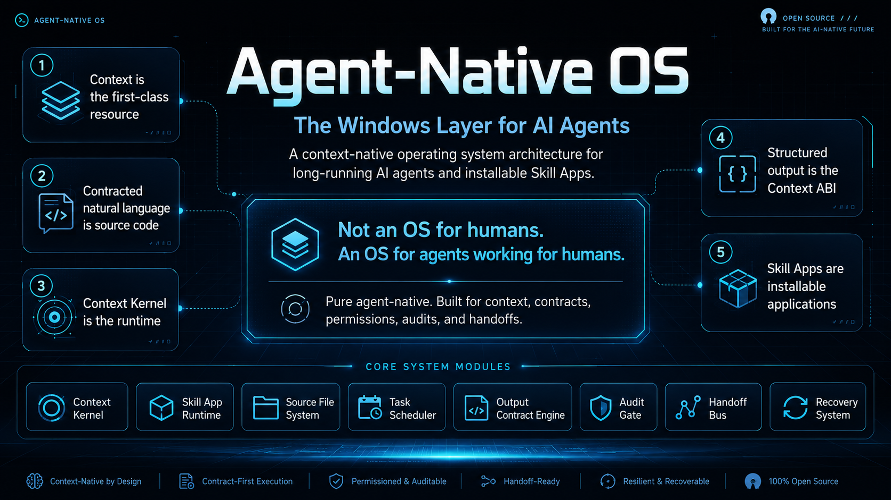
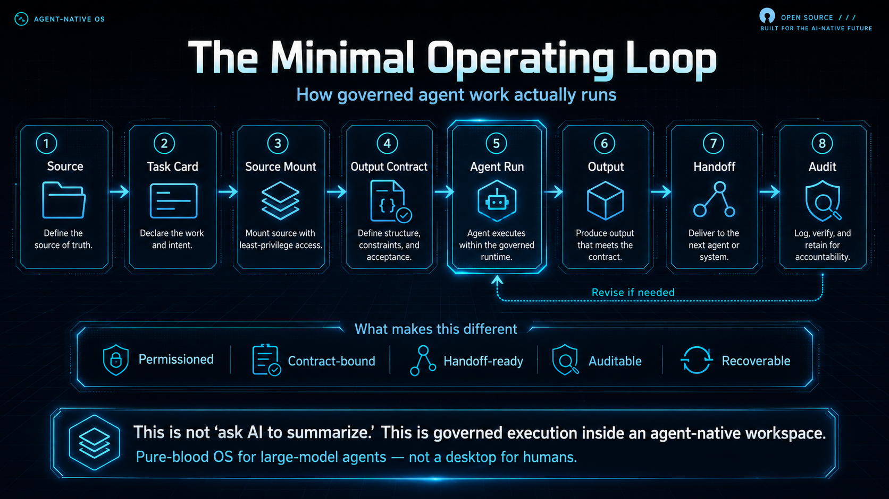
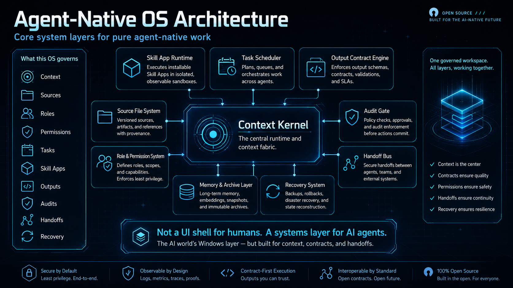
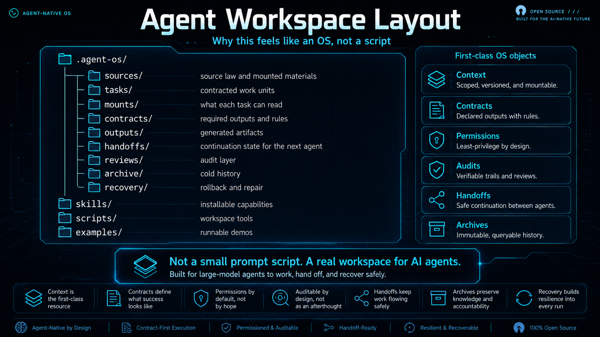

# Agent-Native OS

Languages: [English](README.md) | [简体中文](README.zh-CN.md)

A context-virtualized operating system architecture for long-running AI agents and installable Skill Apps.

**Website:** [https://agent-native-os.semelo.chatgpt.site](https://agent-native-os.semelo.chatgpt.site)


[](https://github.com/bt420000-collab/agent-native-os/actions/workflows/smoke-test.yml)

<p align="center">
  <a href="./docs/assets/homepage/poster-not-human-desktop.png">
    
  </a>
</p>

<p align="center">
  <a href="./docs/assets/homepage/poster-token-effective-work.png">
    
  </a>
  <a href="./docs/assets/homepage/poster-robot-os-standard.png">
    
  </a>
</p>

> **Not teaching AI to use human desktops.**  
> **Giving AI a computer of its own.**

Agent-Native OS is a governed operating layer for AI agents. It gives agents a persistent Host, clean workspace, installable Skill Apps, Host-owned Context Virtual Memory, subagent lifecycle control, cross-App bridges, user-defined Agent topology, and recoverable long-running workflows.

## Core doctrine

```txt
Agent-Native OS Core = persistent Host, runtime, scheduler, permissions, standards
Skill App = installable capability package mounted by the OS
Subagent = worker started, paused, killed, or archived by the OS Host
```

```txt
Apps do not own context. Apps request context.
The Host owns context, agents, workspace permissions, and scheduling.
```

The Host belongs to the mother system. Apps may define coordinators, but Apps are never Hosts.

## Context Virtual Memory

ANO v0.3.0 turns context into a demand-paged OS resource:

```txt
Context Catalog → Task Lease → Agent Working Set → Page Fault → Mount/Evict → Snapshot/Resume
```

The Host pins only the task, authoritative laws, and output contract. Other material is mounted on demand, reduced to a cold reference when inactive, and restored by source version. Registration is not permission; permission is not visibility. Apps cannot widen their own lease or resolve their own Page Faults.

See [CONTEXT_VIRTUAL_MEMORY.md](CONTEXT_VIRTUAL_MEMORY.md).

Before an App runs, it submits a Context Permission Request. The OS displays an Agent Runtime Approval Card with the proposed roles, context budget, workspace permissions, bridge requests, and commercial status. The user may approve, reject, or modify the roster in natural language.

## Ecosystem model

Agent-Native OS Core remains free, open-source, and continuously updated. Skill Apps may be official, community, private, or commercial, and may choose their own pricing model.

```txt
The system provides order.
Apps provide capability.
```

## Runnable reference surface

v0.3.0 is an experimental but runnable reference release. The repository currently provides:

- a current-root workspace initializer;
- a workspace validator with version and Host-gate checks;
- preview-first Skill App installation;
- a lightweight ANO Host command gate;
- an experimental Context VM catalog, lease, working-set, Page Fault, eviction, and snapshot helper;
- three optional official App packages;
- machine-readable manifests, templates, governance documents, and App developer guidance.

The CI smoke test initializes a fresh workspace, validates it, lists staged App packages, previews an installation card, and exercises the Host command gate. This repository is not presented as a production-ready general-purpose OS.

## Visual overview

### From code-for-machines to context-for-agents

<p align="center">
  <a href="./docs/assets/homepage/diagram-from-code-to-agents.png">
    
  </a>
</p>

### Architecture and operating loop

<p align="center">
  <a href="./docs/assets/homepage/diagram-core-architecture.png">
    
  </a>
  <a href="./docs/assets/homepage/diagram-operating-loop.png">
    
  </a>
</p>

### Agent-native system and workspace layout

<p align="center">
  <a href="./docs/assets/homepage/diagram-agent-native-system.png">
    
  </a>
  <a href="./docs/assets/homepage/diagram-workspace-layout.png">
    
  </a>
</p>

## Quick start

ANO installs into the current authorized directory. It must not create `ano-workspace/` or another nested workspace.

```bash
python scripts/init_workspace.py
```

After OS initialization, stop. Do not auto-install any App.

```bash
python ano/scripts/list_app_packages.py
python ano/scripts/install_app_package.py apps/_inbox/official/<package>.zip
python ano/scripts/install_app_package.py apps/_inbox/official/<package>.zip --yes
python ano/scripts/validate_workspace.py
python ano/scripts/context_vm.py status
python ano/scripts/context_vm.py validate
```

The first install command previews the installation card. Use `--yes` only after explicit user approval.

## Installed workspace filesystem

```txt
README.md
USER_LOG.md
ano/
user/
apps/
res/
out/
```

- `ano/`: Host, kernel, Context VM, runtime, registry, scheduler, permissions, bridges, logs
- `user/`: user profile, memory, preferences, imports, and projects
- `apps/`: installed Apps and the App Package Inbox
- `res/`: shared resources
- `out/`: user-facing final exports

Legacy installed roots `.agent-os/` and `skills/` are forbidden.

## OS Host command gate

After installation, every user instruction is mediated by the ANO Host/Admin Agent.

```bash
python ano/scripts/ano_host.py "列出应用"
python ano/scripts/ano_host.py "打开 ANO Tiandao Furnace Skill AppAgent"
python ano/scripts/ano_host.py "打开 ANO 小说工坊"
```

The Host checks installation status, displays permissions and Agent rosters, and stops for user approval. Do not directly run App internals to bypass the Host.

## Official optional App packages

Current packages under `app_packages/official/`:

- `ano-calculator-skill-app_v0.1.2.zip`
- `ano-tiandao-furnace-skill-app_v0.4.0.zip`
- `ano-novel-skill-app_v0.3.1.zip`

The Novel App includes a prose reference layer, Literary Filters, an isolated Material Collection Lab, and Material Governance with usage, handoff, debt, and chapter preflight checks.

See [OFFICIAL_APPS.md](OFFICIAL_APPS.md).

## Developer entry points

- [CONTEXT_VIRTUAL_MEMORY.md](CONTEXT_VIRTUAL_MEMORY.md)
- [APP_DEVELOPER_GUIDE.md](APP_DEVELOPER_GUIDE.md)
- [SPEC.md](SPEC.md)
- [VERSIONING.md](VERSIONING.md)
- [ECOSYSTEM.md](ECOSYSTEM.md)
- [CONTRIBUTING.md](CONTRIBUTING.md)
- [SECURITY.md](SECURITY.md)
- [templates/APP_MANIFEST.yaml](templates/APP_MANIFEST.yaml)
- [templates/CONTEXT_PERMISSION_REQUEST.yaml](templates/CONTEXT_PERMISSION_REQUEST.yaml)
- [templates/CONTEXT_LEASE.yaml](templates/CONTEXT_LEASE.yaml)
- [templates/CONTEXT_PAGE_FAULT_REQUEST.yaml](templates/CONTEXT_PAGE_FAULT_REQUEST.yaml)

## License

Apache-2.0. See [LICENSE](LICENSE).
