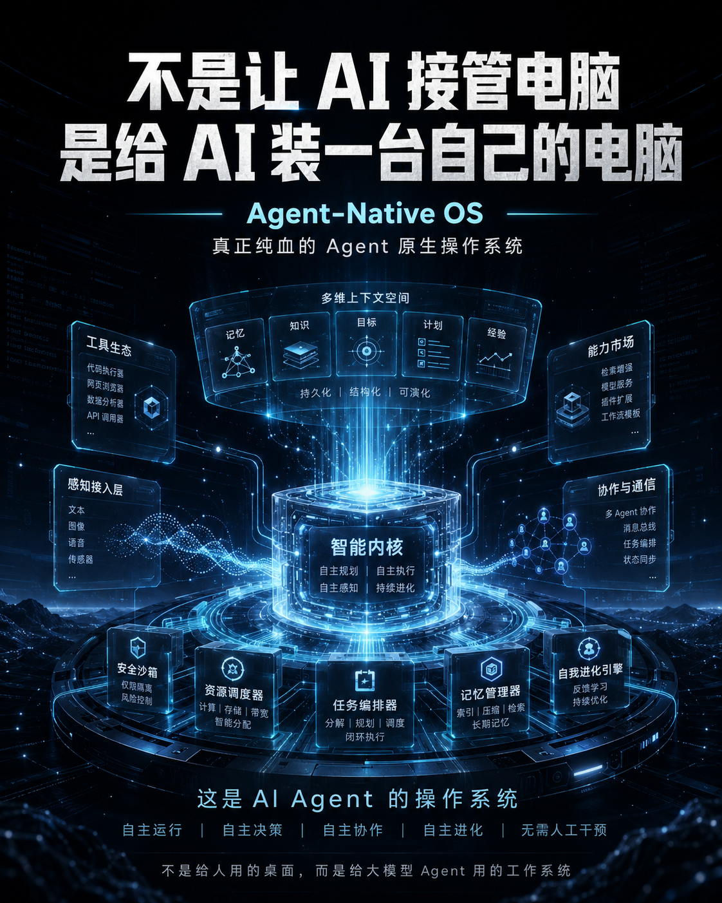
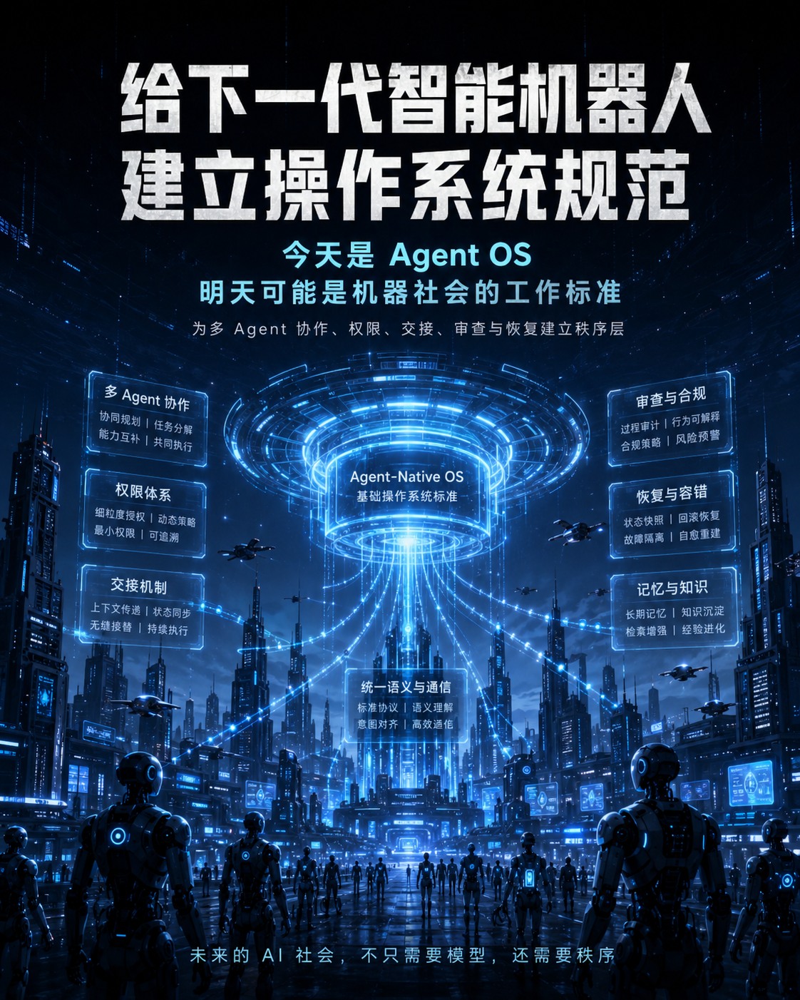
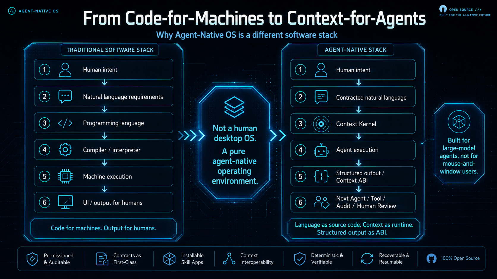
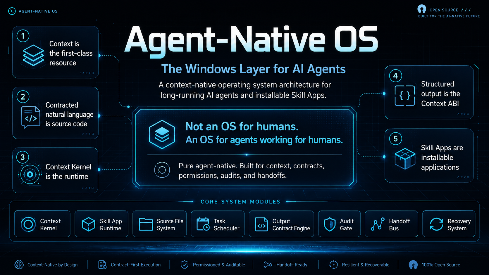
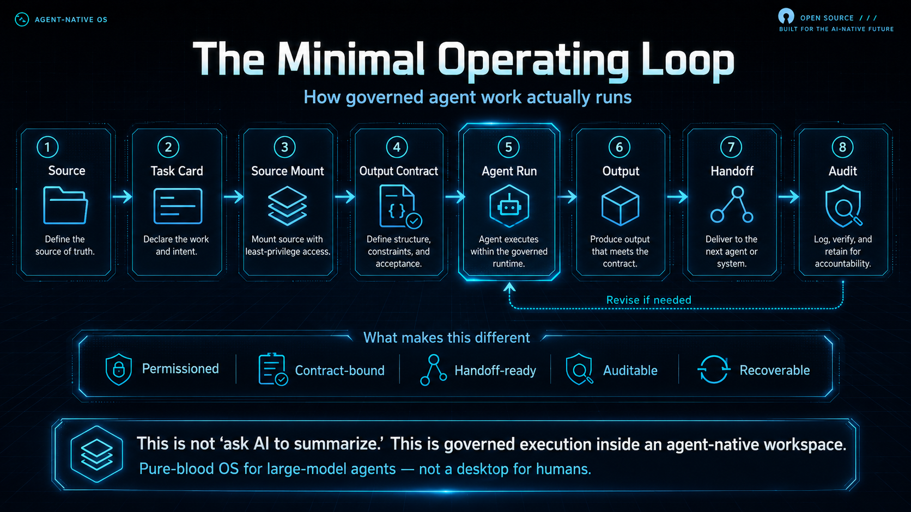
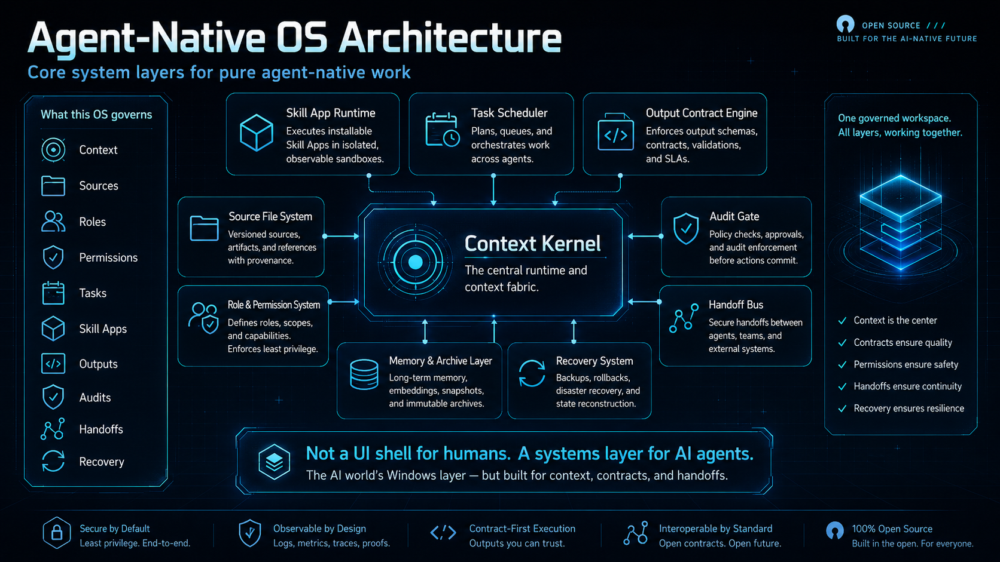
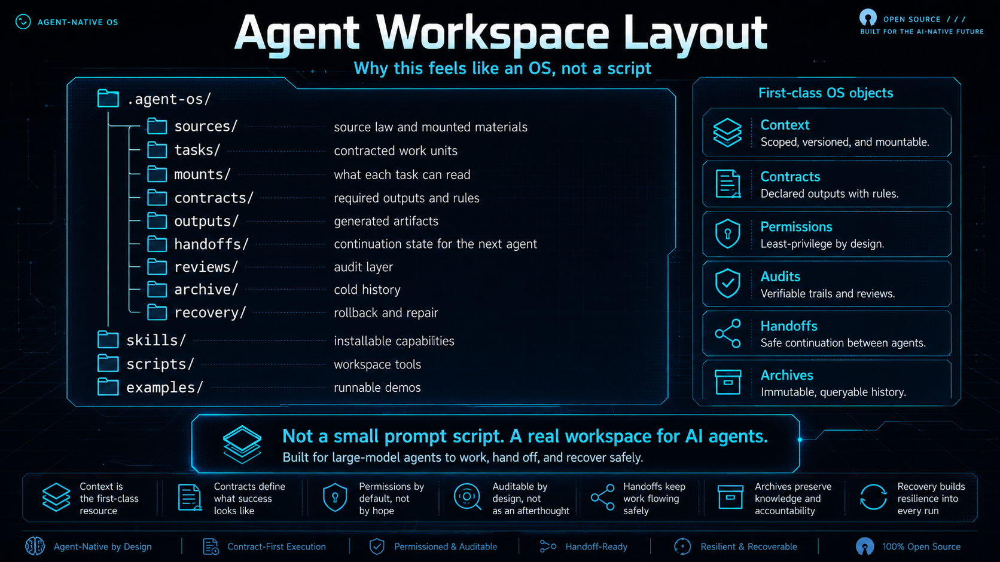

# Agent-Native OS

语言：[English](README.md) | [简体中文](README.zh-CN.md)

面向长任务 AI Agent 与可安装 Skill App 的上下文原生操作系统架构。


<p align="center">
  
</p>

<p align="center">
  
  
</p>

> **不是让 AI 接管电脑。**  
> **是给 AI 装一台自己的电脑。**

Agent-Native OS 不是给人类桌面用的操作系统。
它是给大模型 Agent 用的原生工作系统：一个可治理的工作空间，让 Agent 可以安装 Skill App、管理上下文、隔离任务、执行权限、交接状态，并维持长任务工作的稳定秩序。

通俗说，它就是 **AI Agent 的 Windows 层**。

## 仓库身份说明

Agent-Native OS 是 **规范优先**、**自然语言优先** 的项目。

这个仓库主要由 Markdown/YAML 架构规范、工作区协议和 demo 契约组成。它的核心不是“用 Python 代码运行 Agent”，而是：

> 契约化自然语言是源代码。  
> 上下文内核是运行时。  
> 结构化输出是 Context ABI。

`scripts/` 里的少量 Python 脚本只是 demo 检查和工作区验证工具，不是 Agent-Native OS 的主体实现语言。

## 为什么要做这个项目

今天很多 AI 工具都在解决同一个方向的问题：
让 Agent 更会使用人类电脑，例如浏览器、终端、GUI、API 和现成的应用工作流。

而 Agent-Native OS 问的是一个更底层的问题：

> **Agent 自己工作时，到底需要什么样的操作系统？**

因为 Agent 的工作天然会出现一整套系统病：

- 上下文爆炸
- 法源污染
- 角色串线
- 交接失忆
- 输出失审
- 长程退化
- 工作流混乱导致的大量 token 浪费

Agent-Native OS 的目标，就是减少这些浪费，让每一个 token 更接近真正有效的工作。

## 它的核心判断

在人类 OS 里，第一公民是应用。

在 Agent OS 里，第一公民是上下文。

Agent-Native OS 是一种开放架构，核心包括：

- Context Kernel（上下文内核）
- Skill App Runtime（技能应用运行时）
- Source File System（法源文件系统）
- Role & Permission System（角色权限系统）
- Task Scheduler（任务调度器）
- Output Contract Engine（输出契约引擎）
- Audit Gate（审查门禁）
- Handoff Bus（交接总线）
- Memory & Archive Layer（记忆与归档层）
- Recovery System（恢复系统）

## 五大原则

1. **上下文是第一资源。**
2. **契约化自然语言是源代码。**
3. **上下文内核是运行时。**
4. **结构化输出是 Context ABI。**
5. **Skill App 是可安装应用。**

## 为什么它不只是一个小工具

Agent-Native OS 不只是给文档整理或代码 Agent 用的。
它指向的是一层更大的基础设施：未来 Agent 世界的工作秩序层。

它的价值包括：

- 更高效的 AI 有效工作流
- 更少的上下文浪费与 token 浪费
- 更稳定的多 Agent 协作
- 更清晰的权限、审查、交接与恢复规范
- 为未来具身智能与机器人操作系统建立基础规则

## 视觉总览

### 1）从 code-for-machines 到 context-for-agents

<p align="center">
  
</p>

### 2）系统架构与最小工作闭环

<p align="center">
  
  
</p>

### 3）Agent 原生系统与工作区布局

<p align="center">
  
  
</p>

## 试跑 Demo

运行：

```bash
python scripts/run_docs_brief_demo.py
```

然后打开：

```txt
examples/docs-brief-demo/PROMPT_FOR_AGENT.md
```

把提示词复制给 Codex、ChatGPT、Claude 或其他 Agent，让它按 Agent-Native OS 的任务契约生成产物。

验证工作区：

```bash
python scripts/validate_workspace.py examples/docs-brief-demo
```

这个 Demo 展示最小可治理闭环：

```txt
Source -> Task -> Mount -> Output Contract -> Agent Prompt -> Handoff -> Audit
```

## 仓库结构

```txt
agent-native-os/
  README.md
  README.zh-CN.md
  MANIFESTO.md
  SPEC.md
  ROADMAP.md
  CORE_THEORY_AND_GLOSSARY.md
  NAMING_STRATEGY.md
  BILINGUAL_POLICY.md
  docs/
  spec/
  templates/
  examples/
  scripts/
```

## 开放内核，私有发行版

本仓库定义的是开放架构。

领域专用发行版可以基于本架构构建。私有发行版可能包含行业工艺、商业逻辑、评分系统和专有工作流，不包含在本仓库之内。

**开放架构，保留私有发行版。**

## 建议 GitHub 简介

```txt
A context-native operating system architecture for long-running AI agents and installable Skill Apps.
```

## 建议 topics

```txt
ai-agents
agent-os
agent-native
context-engineering
context-native
multi-agent
skill-apps
workflow-automation
agent-framework
ai-native
```

## 协议

Apache-2.0。见 `LICENSE`。
